# proscenio

A desktop shell for Hyprland, written in Rust with GTK 4. It draws everything around the windows:
the bar, the sidebar with its quick toggles, notifications, the dock, the launcher and workspace
overview, on-screen indicators, the session and lock screens, and a settings app for the shell and
for Hyprland itself. Its colors come from the wallpaper.

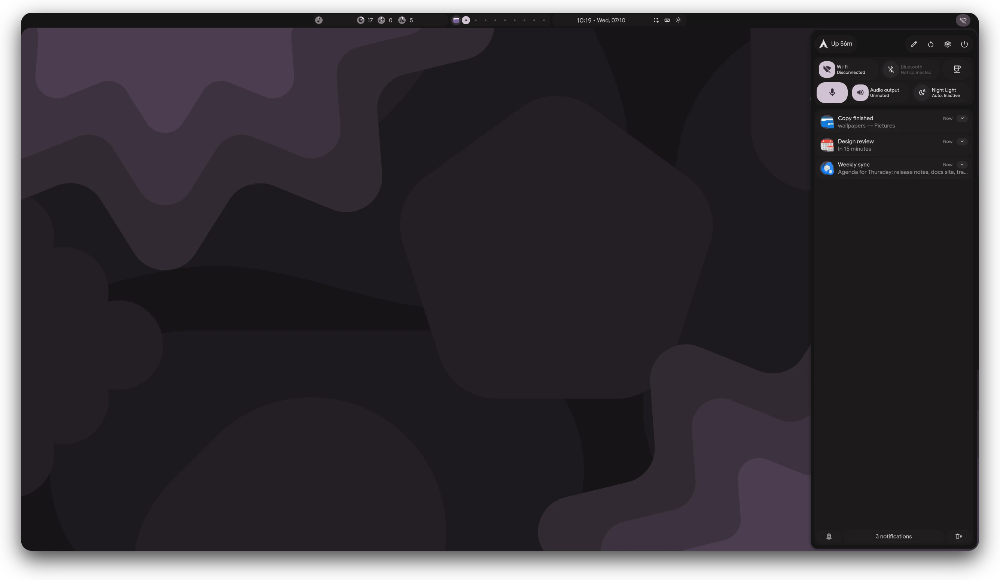

| | |
|---|---|
| 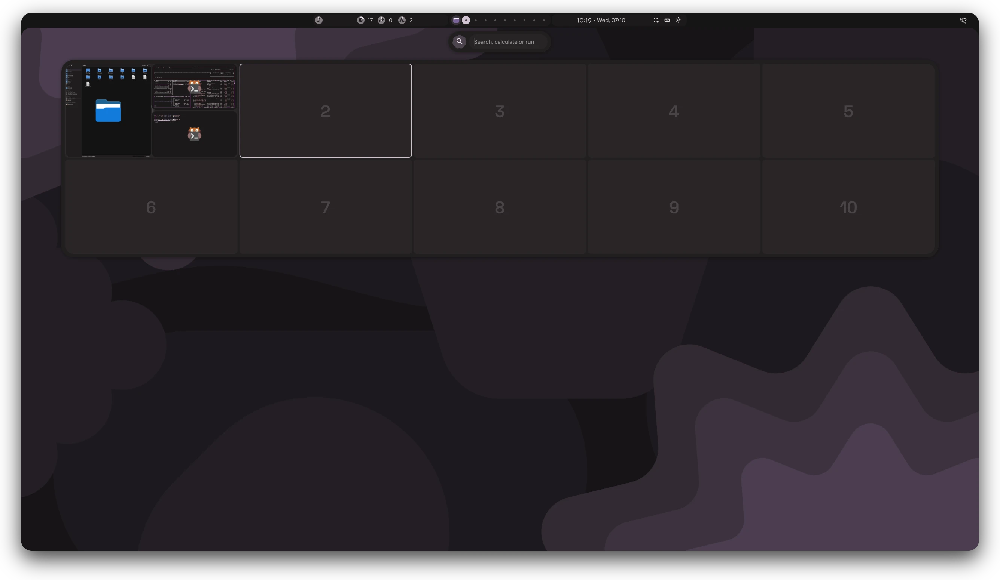 | 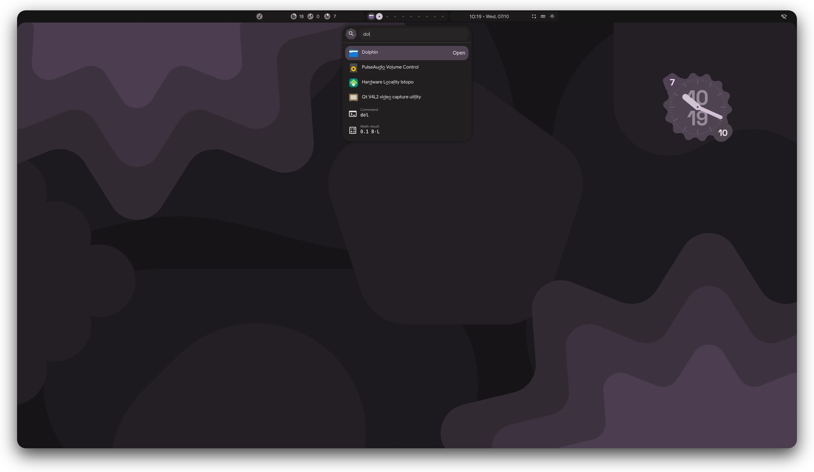 |
| 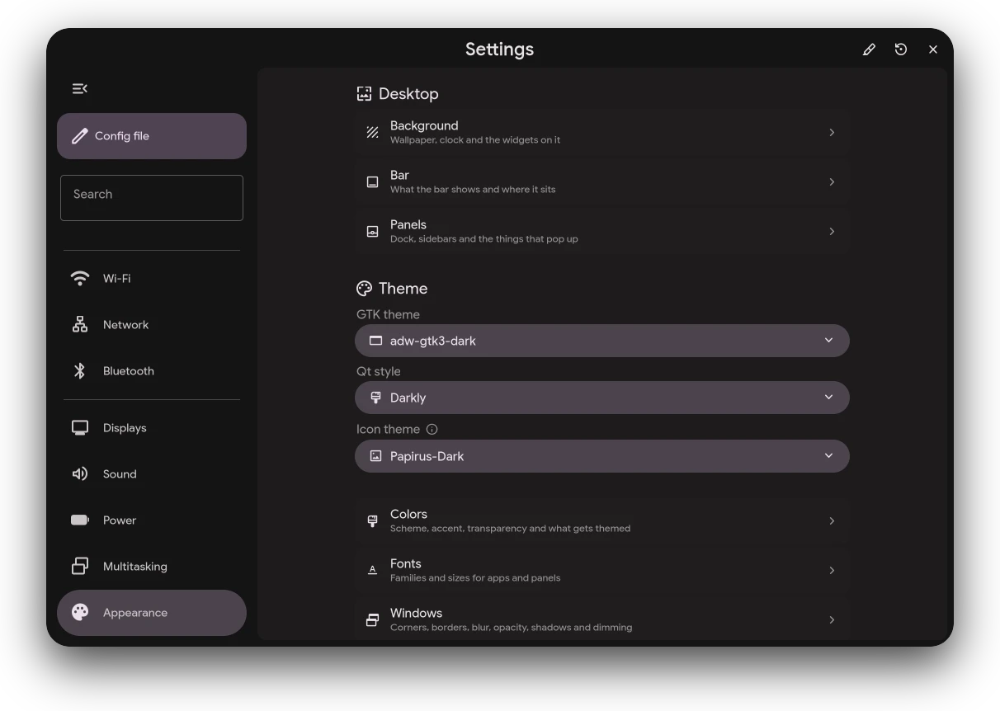 | 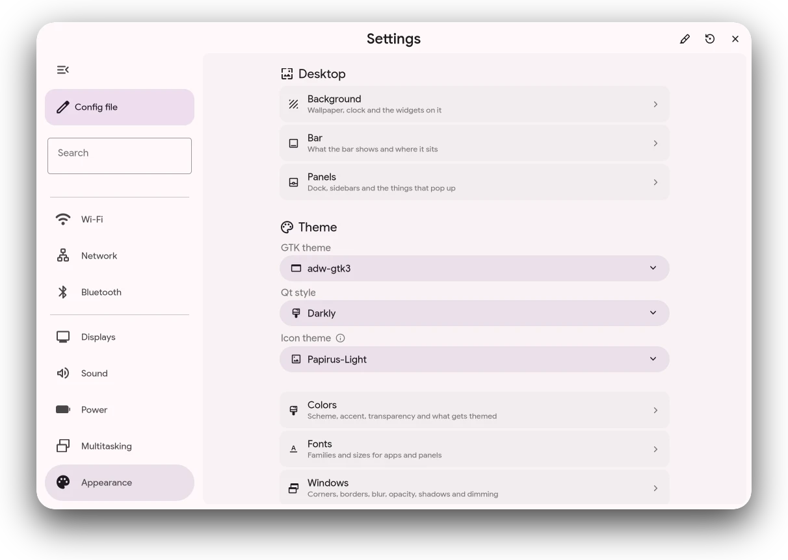 |
| 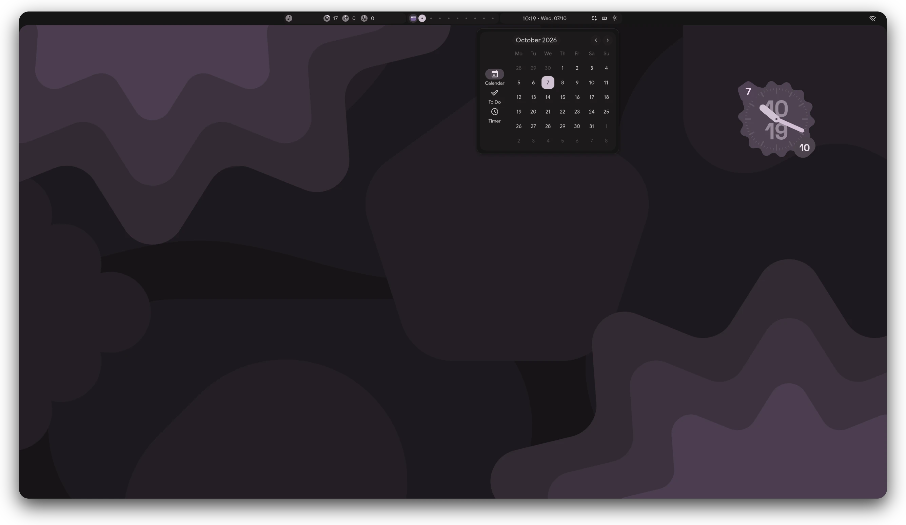 | 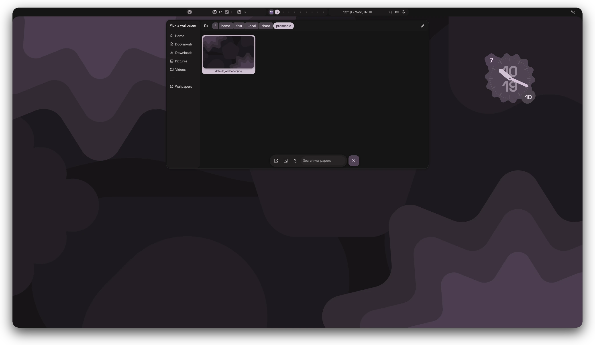 |
| 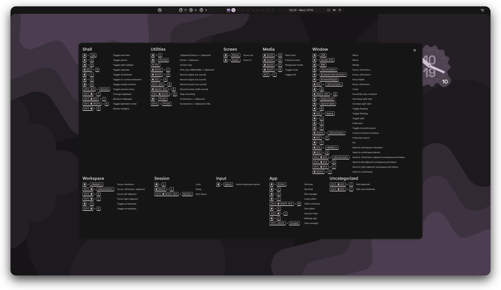 | 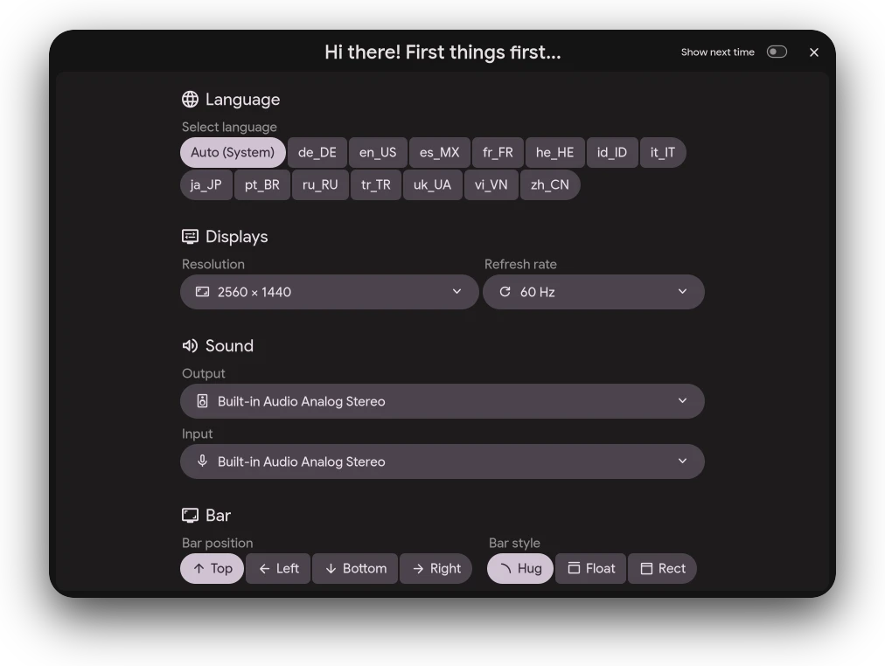 |
| 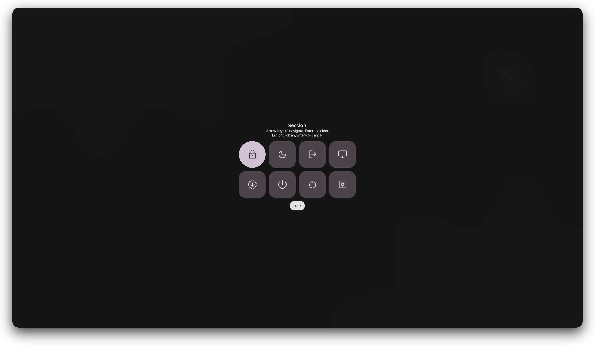 | 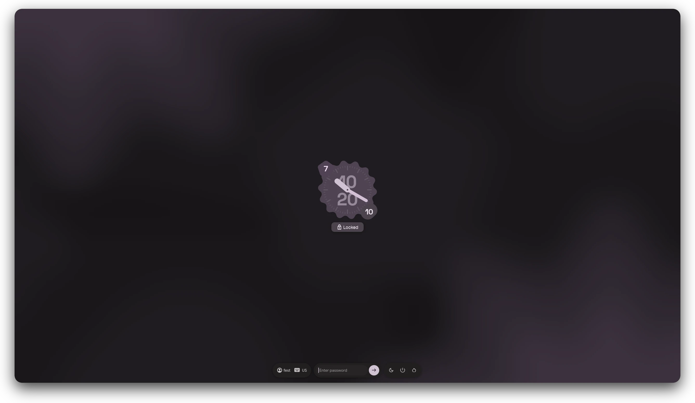 |
| 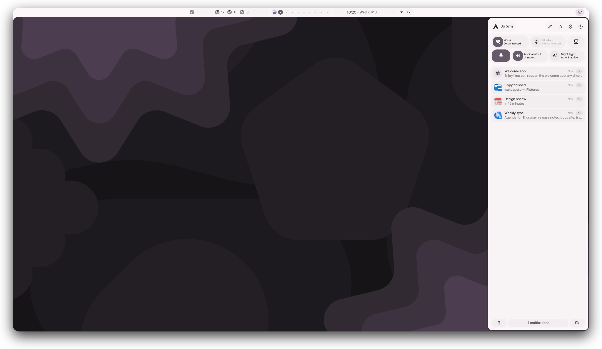 | 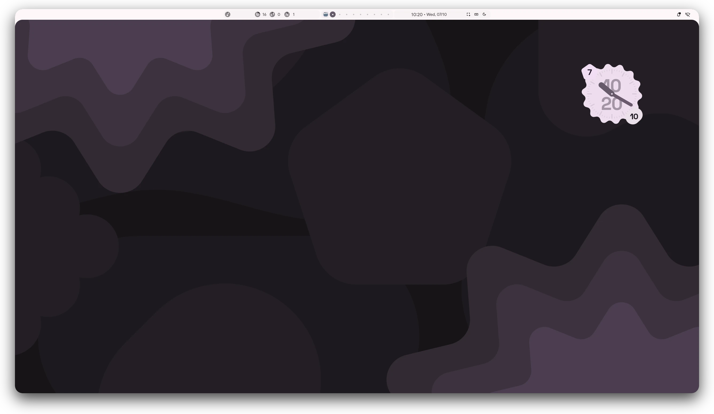 |

## Install

On Arch Linux, `packaging/PKGBUILD` builds the package `fEst-proscenio` from `main`:

```bash
curl -fsSLO https://raw.githubusercontent.com/The1fEst/proscenio/main/packaging/PKGBUILD
makepkg -si
```

proscenio runs only on Hyprland. [hypr-dots](https://github.com/The1fEst/hypr-dots) installs it
together with the Hyprland config and apps it is set up with.

## Documentation

[the1fest.github.io/proscenio](https://the1fest.github.io/proscenio/docs/) describes every panel,
setting, command and file, and how the shell is built. The pages are in `docs/`.
