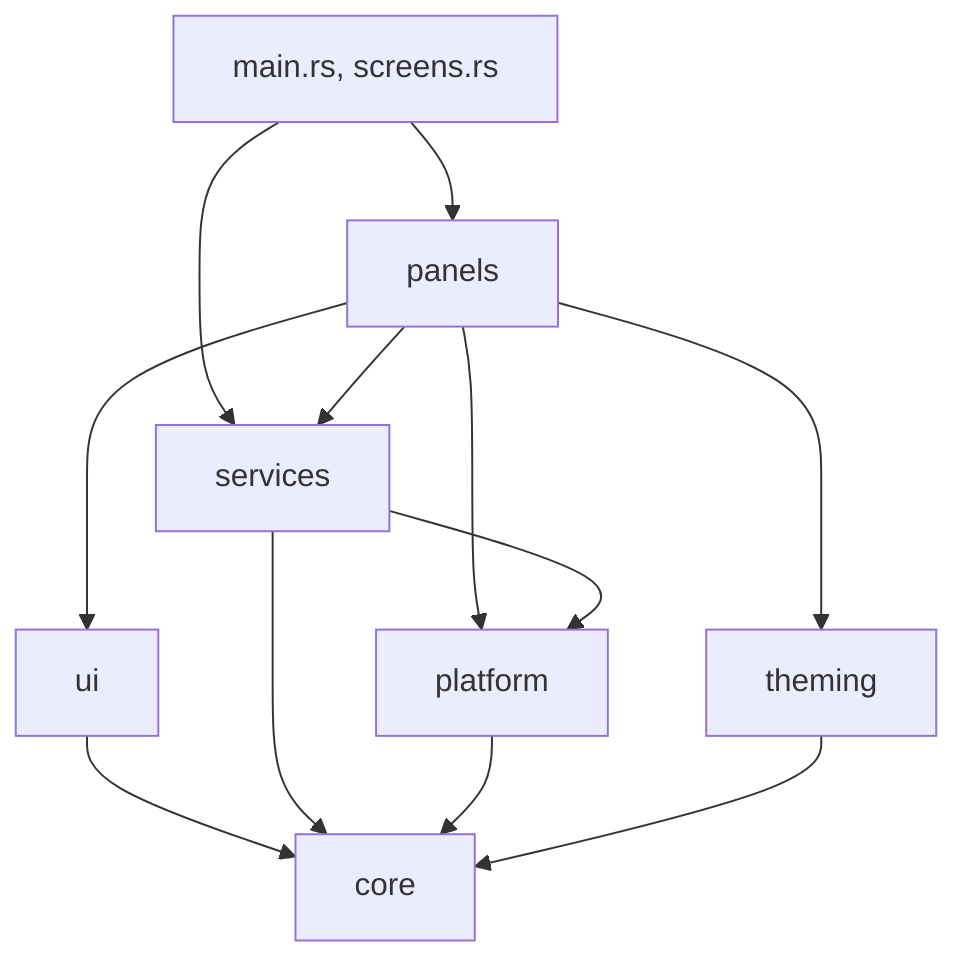

# Architecture

proscenio is one process running one GTK application, `dev.fEst.Proscenio`. Everything happens on
the GLib main loop of its main thread: widgets, services, Hyprland events, D-Bus and PulseAudio. Work
that would block, such as reading a command's output, decoding an image or taking Hyprland's state
snapshot, goes to a worker thread through `gio::spawn_blocking` and comes back to the main loop with
its result. Shared state is `Rc` and `RefCell`, without locks.

## Source layout

| Path | Holds |
|---|---|
| `src/main.rs` | Startup, the bar window, the IPC targets and the global shortcuts |
| `src/screens.rs` | The surfaces each monitor gets, built and torn down as monitors and settings change |
| `src/panels/` | One module per surface: the bar, the sidebar, the overview, the dock, notifications, the lock screen, the settings window and the rest |
| `src/services/` | Shared state that panels read and listen to: audio, network, notifications, Hyprland's state and more |
| `src/platform/` | The world outside the process: Hyprland's IPC and config files, Wayland protocols, D-Bus services, PAM, udev |
| `src/ui/` | The theme, the widgets, motion, and the unloading of hidden surfaces |
| `src/theming/` | Palette generation and the wallpaper switch |
| `src/core/` | Config, paths, translations, processes, listeners and scopes, the action registry |
| `protocols/` | The Wayland protocol XML the client code is generated from |
| `assets/` | Translations, icons and templates built into the binary |

## Startup

`main` does a few things before GTK starts:

1. `unload::single_arena()` sets glibc's `M_ARENA_MAX` to 1 before any thread exists, so every thread
   allocates from one heap instead of keeping freed memory in an arena of its own.
2. A first argument may name a subcommand. The helpers that run as root through `pkexec`
   (`set-system-locale`, `firewall`, `power-settings`) do their work and exit; `ipc` sends one call to
   the running shell; `colors`, `switchwall`, `record` and `renderer-check` run their tool.
   [Command line](command-line.md) lists them.
3. Started through `pkexec` for anything else, it exits instead of drawing as root.
4. It chooses the renderer, as described at the end of this page.
5. GTK starts the application. A second `proscenio` in the same session hands its activation to the
   one already running and exits, so the shell is never built twice.

Then `build` assembles the shell:

1. It loads the config, sets the font families, builds the theme and installs the stylesheet, and
   starts watching the palette file.
2. It tidies the Hyprland settings files, as [Hyprland integration](hyprland.md) describes.
3. `Services::new` creates every service, opens the system and session buses, and registers the
   background tasks.
4. It starts the tray watcher and the device notifications, and registers the polkit agent and the
   keyring prompter. If `mako` or `dunst` is running, it offers to stop it, or stops it without asking
   when `conflictKiller.autoKillNotificationDaemons` is on.
5. It creates the parts that exist once per session: the on-screen display, the region selector, the
   wallpaper selector, the settings and welcome windows, the on-screen keyboard and the lock screen.
   Each builds its window only when it opens.
6. `Screens` builds the per-monitor surfaces.
7. It registers the IPC targets, served on the session bus, and publishes every action as a Hyprland
   global shortcut. [IPC](ipc.md) and [Shortcuts](shortcuts.md) list them.
8. It starts following the monitor list and Hyprland's event socket, adds the `trim` task, and opens
   the welcome window on the first run. When `lock.launchOnStartup` is on, it locks the screen the
   first time it starts in a Hyprland session.

Once per login it also starts the enabled XDG autostart entries.

## Services, panels and the platform layer

**Services** (`src/services/`) each own one piece of state and a list of listeners. `subscribe`
returns a `Subscription`, and dropping the subscription removes the listener. `Services::new`
creates them all once; they live for the whole run and are shared by every monitor. `HyprState` holds
Hyprland's monitors, workspaces and windows, `Audio` runs libpulse on the GLib loop, `Net` follows
NetworkManager, `Notifications` is the notification server, and `States` carries shell-wide flags:
the bar shown, the sidebar or the on-screen keyboard open, the screen locked, the Super key held.

**Panels** (`src/panels/`) build windows and widgets, read services when they draw, and subscribe to
them for changes. An IPC call or a shortcut that opens a panel acts on the panel of the monitor
Hyprland reports as focused.

**Platform** modules (`src/platform/`) wrap one outside system each and hold no UI: `hypr.rs` speaks
Hyprland's IPC, `hyprconfig.rs` and its neighbors write Hyprland's config, `grab.rs`, `shortcuts.rs`,
`capture.rs` and `locknotify.rs` speak Hyprland's Wayland protocols, and the rest talk to D-Bus
services, PAM, udev and the programs the shell runs.

**UI** (`src/ui/`) is the [design system](design.md): the theme, the widgets and the motion
primitives, plus `unload.rs` and `reserve.rs` below.

## Configuration

The config is `~/.config/proscenio/config.toml`. `Config::load` reads it into one struct, with a
default for every missing key. A write changes one key with `toml_edit`, so the rest of the file keeps
its comments and layout, and replaces the file through a temporary copy so a reader never sees half
of it.

One file monitor watches the config. `watch::config(path, action)` runs `action` only when the value
under that key path changed, so a listener on `bar` stays asleep when `dock` changes.
`config::current()` returns the parsed config and parses the file again only after it changed. Code
that has to follow edits without a restart reads through it.

## Per-monitor surfaces

`src/screens.rs` gives every monitor its own set of surfaces, grouped in parts. Each part is rebuilt
on every monitor when a config key it was built from changes.

| Part | Windows | Rebuilt when these change |
|---|---|---|
| Panels | Sidebar, calendar, session screen, media controls | `sidebar.quickToggles.style`, `sidebar.quickToggles.android.columns`, `sidebar.quickSliders`, `bar.bottom`, `bar.vertical`, `bar.cornerStyle` |
| Overview | The overview and launcher | `overview` |
| Sheet | The cheatsheet | `cheatsheet` |
| Popups | Notification popups | — |
| Background | The background, unless started with `--no-background` | `background.hideWhenFullscreen`, `background.parallax`, `bar.workspaces.shown` |
| Dock | The dock, when `dock.enable` is on | `dock.enable`, `dock.height`, `dock.hoverRegionHeight`, `dock.hoverToReveal`, `dock.monochromeIcons`, `dock.ignoredAppRegexes` |
| Bar | The bar and the screen corners | `bar` except `bar.screenList` and the weather keys, `tray.filterPassive`, `tray.invertPinnedItems`, `tray.monochromeIcons`, `tray.showItemId`, `battery.low`, `interactions.deadPixelWorkaround`, `appearance.fakeScreenRounding`, `sidebar.cornerOpen` |

Changes are collected and rebuilt together once the main loop is idle. The bar holds the panels and
the overview, so rebuilding either rebuilds the bar too. A font change rebuilds every part, an icon
theme change every part but the background, and a Hyprland config reload that changes
`decoration:rounding` rebuilds the bar.

The set of monitors is synced at startup, when a monitor is added or removed, and when one changes its
connector or geometry. A monitor gets surfaces once it has a connector name and a width. One that
disappeared or changed geometry loses all of its surfaces, and the next sync builds a fresh set.
`bar.screenList` limits the shell to the monitors it names; when none of them is connected, every
monitor gets surfaces.

## Scopes and teardown

Each built part owns a `Scope` (`src/core/scope.rs`). Into it go the subscriptions its panels took,
the config watches and background tasks they started, values they need kept alive, and actions to
run at the end. Dropping the scope unsubscribes, runs those actions and then drops what it held.
Parts that live for the whole run, such as the on-screen display and the polkit agent, mark their
subscriptions with `forever()`.

The windows of a dropped part go through `unload::discard`. It destroys the window and disposes it,
which releases its child, then disposes every widget of the old tree that is still alive without a
parent: a widget kept only by a closure inside its own subtree. It repeats until no such widget is
left. A widget still inside a parent is left to that parent's dispose.

Disposing a widget releases its signal handlers, but not its event controllers or closures kept in
its own fields. A closure stored in either place must therefore not hold the widget, one of its
ancestors, or an `Rc` that owns them. It takes a weak reference, or asks the gesture for its widget.

## Focus grabbing

A panel such as the sidebar closes when you click anywhere outside it. That is Hyprland's
`hyprland-focus-grab-v1` protocol, in `src/platform/grab.rs`.

The sidebar, the calendar, the media controls, the cheatsheet, the overview and the wallpaper selector
each own a `Grab`. All of them share one manager and one event queue on GTK's own Wayland
connection. Opening a panel creates a grab holding the panel's surface, plus every persistent surface,
and commits it. When you click outside those surfaces, Hyprland clears the grab and the panel closes
itself. The shell reads the grab events only while a grab is held.

The on-screen keyboard is the one persistent surface, so typing on it never closes the panel you are
typing into. A click on the bar or on a screen corner does close an open panel.

## Unloading hidden surfaces

A surface that is not shown should not hold memory, and proscenio handles that in two ways.

Surfaces that open and close often stay built and give back their rendering resources while hidden.
That covers every per-monitor window and the dock's window-preview popover. `unload::when_hidden`
waits a second after the window hides; if it is still hidden and has not been shown in between, it
unrealizes the window and trims the heap. Unrealizing drops the surface with its renderer, buffers
and caches, while the widget tree stays, and the next show realizes it again. The second of delay
leaves time for a pending GTK tooltip, which still looks up the surface the pointer was last over.

Surfaces opened rarely are built when they open and destroyed when they close: the settings and
welcome windows, the on-screen display, the on-screen keyboard, the polkit and keyring dialogs, the
wallpaper selector, the region selector and the one-off dialogs.

glibc keeps memory freed in the middle of its heap until it is asked to trim. Every unrealize calls
`malloc_trim(0)`, and again 1.5 s later for memory freed after that moment. In between, the `trim`
background task reads the resident size from `/proc/self/statm` on every tick and trims whenever it
has grown more than 1 MB since the last trim.

## The background loop

All periodic work runs from one loop, `src/services/background.rs`. It ticks once at startup and then
every `resources.updateInterval` milliseconds (3000 by default), reading the interval again on every
tick, so a change in the settings applies on the next one. A task is a name and a function returning
a `Result`; an error is logged as `background: <name> failed: …` and the loop carries on.

A task may carry a period. It then runs on the first tick at least that long after its last run, so
slow tasks share the loop without running every few seconds. Periods are read on every tick too, and
are zero while their feature is off, so switching the feature on runs the task on the next tick.

| Task | Does |
|---|---|
| `resources` | Samples memory and CPU from `/proc/meminfo` and `/proc/stat`, once for all the bars |
| `media position` | Reads the players again while one is playing |
| `recording` | Looks for a running `wf-recorder` in `/proc` while no recording is known, without starting a process |
| `night light schedule` | Re-evaluates the night light schedule when the minute changes |
| `warp` | Reads `warp-cli status` once WARP is found |
| `weather` | Fetches the weather every `bar.weather.fetchInterval` minutes (10) while `bar.weather.enable` is on |
| `updates` | Counts available updates every `updates.checkInterval` minutes (120) while `updates.enableCheck` is on |
| `trim` | Trims the heap, as above |
| `clock details`, `uptime` | Added per monitor by the bar's clock and the sidebar, for as long as those exist |

`add_scoped` returns a `Subscription` instead of keeping the task for the whole run, and a monitor's
panels keep theirs in the monitor's scope. Outside the loop stay the timers that run only while
something is under way, such as the stopwatch, the pomodoro and a recording's clock, and one-shot
delays. The bar's clock keeps its own timer, aligned to the minute, or ticking every second with
`time.secondPrecision`.

## Fullscreen windows

On a monitor whose active workspace shows a real fullscreen window (Hyprland's `fullscreen` state 2),
the permanent surfaces step aside: the bar, the dock with its trigger strip, and the screen corners
hide, and so does the background unless `background.hideWhenFullscreen` is off. The corners stay when
`appearance.fakeScreenRounding` is 1, which asks for them over fullscreen windows too.

`src/services/fullscreen.rs` keeps the set of covered monitors. It reads them from the snapshot in
`src/services/hyprstate.rs`, which reads `monitors`, `workspaces`, `clients` and `activewindow` over
IPC on a worker thread after each relevant event, folding the events that arrive during a read into
one more read.

Hiding the bar would drop its exclusive zone, so the tiled windows of the next workspace would lay out
without it and jump when the bar comes back. While the bar, or a pinned dock, is hidden this way, a
1×1 layer surface on the same edge (`src/ui/reserve.rs`) holds the zone. It takes no input, and its
one pixel has an alpha of 1/255, because a surface that paints nothing is never mapped.

## Translations

Interface text is English in the source and goes through `src/core/i18n.rs` where it is shown:

- `tr(text)` returns the translation of `text`, or `text` itself when the catalog has none;
- `trf(text, arguments)` translates, then replaces `%1`, `%2` and so on with the arguments.

The catalogs are `assets/translations/<code>.json`, one JSON object per language that maps the
English text to its translation, built into the binary: de_DE, en_US, es_MX, fr_FR, he_HE, id_ID,
it_IT, ja_JP, pt_BR, ru_RU, tr_TR, uk_UA, vi_VN and zh_CN. An empty value counts as missing, and a
value ending in `/*keep*/` is shown without that suffix.

The language is `language.ui`. With `auto`, the default, it is the first locale the system reports
other than `C`, without its encoding and modifier: `ru_RU.UTF-8` becomes `ru_RU`. The catalog loads
on the first `tr` call. `~/.config/proscenio/translations/<code>.json` is read first and the built-in
catalog is laid over it, so that file adds entries but does not replace built-in ones.

Choosing a language other than `auto` also makes it the system language, so applications and the
login screen follow after the next login. The catalog code names the locale, `<code>.UTF-8`, except
he_HE, which becomes `he_IL.UTF-8`. When `/etc/locale.gen` does not enable that locale or
`/etc/locale.conf` does not choose it, the shell runs `pkexec proscenio set-system-locale <locale>`,
which asks for the password through the shell's own [polkit agent](polkit.md). As root, that command
enables the locale in `/etc/locale.gen`, uncommenting its line or adding one, runs `locale-gen` when
the file changed, and runs `localectl set-locale LANG=<locale>`. The shell restarts once the command
exits, whether or not the password was given. `auto` leaves the system language alone.

Text is translated when a widget is built, so switching the language takes a restart. Static tables,
such as page names, quick toggle names and choice labels, keep their English text and are translated
where they are displayed. The settings search index is built from the English titles when the binary
is compiled, and the search matches their translations in every catalog.

## Renderer

GTK's Cairo renderer is the default, so the shell's surfaces hold no GPU memory. The `renderer` key
picks `cairo`, `opengl` or `vulkan`, and `main` passes it to GTK as `GSK_RENDERER` before GTK starts.
A `GSK_RENDERER` already set in the environment wins over the setting. Once the windows are built the
shell clears the variable, so the applications it starts do not inherit it.

A renderer picked in the settings is on trial. The previous one is kept in `rendererFallback`, and at
the next start the shell launches `proscenio renderer-check`, a separate process drawn with Cairo so
that it shows even if the trial renderer fails. It asks whether to keep the renderer, counting down
15 seconds. Keeping it, reverting, closing the dialog or letting the time run out answers the shell
over IPC (`renderer keep` or `renderer revert`), and a revert restarts the shell on the previous
renderer. If the shell does not answer, the check writes the choice to the config itself and, on a
revert, starts a fresh shell. `proscenio ipc call renderer reset` goes back to Cairo from a terminal.
